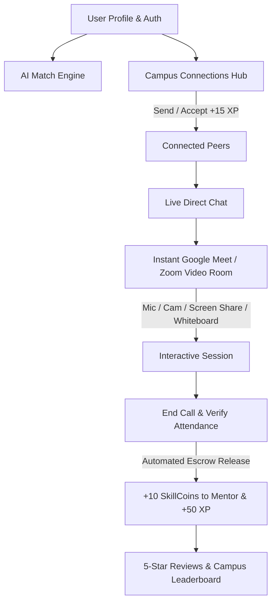

# SkillSwap — Peer Skill Exchange & Campus Mentorship

**SkillSwap** is a full-stack peer-to-peer student skill exchange and live mentorship platform built for the **Omnikon National Hackathon 2026** (EdTech & Skill Development, Problem Statement `Omni_EdTech_10`).

The platform solves the campus skill silo problem by introducing a zero-cost time-bank economy powered by intelligent AI match scoring, structured learning path roadmaps, an authentic **Google Meet & Zoom style WebRTC live video meeting suite**, real-time peer connection networking, encrypted live chat, and dual-verification session check-in.

---

## 🚀 Key Features

*   **Zero-Cost Time-Bank Economy**: **$1\text{ Hour Taught} = 10\text{ SkillCoins} = 1\text{ Hour Learned}$**. Users earn coins by teaching and spend them to learn from peers, with coins held securely in escrow during active bookings.
*   **Google Meet & Zoom WebRTC Meeting Suite**:
    *   **Pre-Join Green Room Lobby**: Real webcam and mic hardware diagnostic preview with audio VU volume activity meter.
    *   **Dynamic Zoom Video Grid**: Responsive gallery layout with active speaking glow indicator borders.
    *   **Real Screen Sharing**: Native browser screen/window/tab presentation with track replacement.
    *   **In-Call Collaboration Tools**: Integrated in-call live chat drawer, participants list, collaborative shapes whiteboard with PNG export, and live JavaScript code runner.
    *   **Raise Hand (✋) & Emoji Reactions**: Floating live reaction particles (`🔥`, `👏`, `💡`, `❤️`, `🚀`, `🎉`).
*   **Peer Connections & Networking**:
    *   **Discover & Add Connections**: Search campus students by major and skills, and send personalized connection notes.
    *   **Pending Requests Manager**: Review incoming connection requests with 1-click **Accept (+15 XP)** or Decline.
    *   **My Connections Directory**: View connected mentors, active online status, and 1-click Live Chat & Meeting launch.
*   **Live Encrypted Peer Chat**: Direct real-time messaging between connected peers with timestamped history, emoji quick replies, and instant meeting triggers.
*   **Secure Authentication & Session Sync**: JWT token authorization, HTTP-only cookie session management, and bcrypt password hashing.
*   **AI Match Engine**: Recommends matches with percentage compatibility scores based on teaching skills, learning goals, proficiency matching, schedule overlap, and review history.
*   **AI Learning Roadmaps & AI Mentor**: Generates custom week-by-week learning paths with actionable checklists, milestones, and conversational study guidance.
*   **Dual Attendance Verification**: In-person campus sessions use an animated QR scanner and 4-digit OTP system to prevent no-shows and release escrow.
*   **Reputation Rating & Leaderboard**: 5-star peer review system with unlockable achievement badges (Master Mentor, Design Wizard, Algorithm Ace) and campus XP standings.

---

## 🛠️ Technology Stack

*   **Frontend & Routing**: Next.js 15+ (App Router, Server & Client Components)
*   **Styling**: Modern Glassmorphic Dark UI + Tailwind CSS & CSS Variables
*   **Icons**: Lucide React
*   **Video & Audio**: WebRTC (`RTCPeerConnection`), Google STUN Servers, Web Audio API `AnalyserNode`, `navigator.mediaDevices`
*   **Authentication**: JWT (`jsonwebtoken`), Password Hashing (`bcryptjs`), HTTP Cookies
*   **State & Signaling**: React Context, BroadcastChannel, REST Signaling API
*   **Animations**: Canvas Confetti, CSS Keyframe Floats

---

## 📐 Architecture & Closed-Loop Workflow



---

## ⚙️ Local Development & Setup

### Prerequisites
*   Node.js 18+
*   npm or yarn

### Installation
1. Clone the repository:
   ```bash
   git clone https://github.com/kartiksaste77/Omnikon-Hackathon-.git
   cd Omnikon-Hackathon-
   ```
2. Install dependencies:
   ```bash
   npm install
   ```
3. Run the development server:
   ```bash
   npm run dev
   ```
4. Open [http://localhost:3000](http://localhost:3000) in your browser.

---

## 📄 License & Team

*   **License**: MIT License
*   **Team**: `kartiksaste11`
    *   **Kartik Saste** — Next.js scaffolding, WebRTC video meeting engine, AI match scoring algorithm, AI roadmap generator, auth & connections subsystem, and glassmorphic design system.
    *   **Karan Rathod** — Dual QR/OTP verification flows, mock ledger service, gamification stats, and responsive UI grid.
